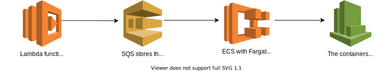
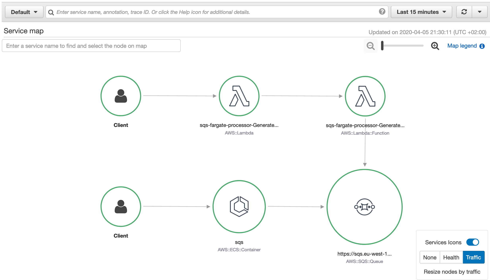
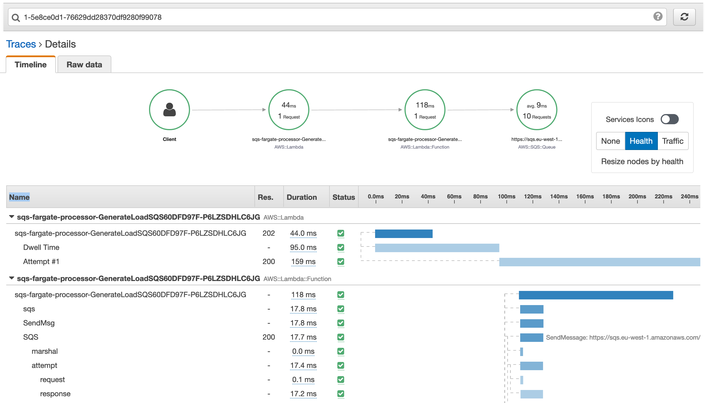

sqs-fargate-poller
==================

Deploy an SQS queue triggered Fargate container using the AWS CDK, which scales up or down depending on the amount of messages on the queue. In addition, a load generator Lambda is included which puts random messages on the SQS queue. The container and Lambda functions are instrumented with XRay which allows for precise monitoring of performance and success rates. 

The Lambda function and Fargate container are instrumented with XRay, so that you can review operational metrics from the XRay Service Map.

You can also inspect individual Lambda or Fargate traces to see how long AWS service calls and processing took.

Motivation
----------

While Lambda functions are great for event driven tasks from a cost and maintenance perspective, not every process can be easily ported to utilize them. You may already have a Docker container available for your solution which contains binaries or specific dependancies that can be tough to move to Lambda. In some other cases, more than 3GB memory is required during runtime or tasks need to run longer than 15 minutes. 

 Fargate with ECS deployed through CDK offers an alternative for these cases for the following reasons;

 - Fargate clusters and VPC's are free of charge, which means you do not have a fixed cost for running the solution. 
 - All the components also don't require any ongoing maintenance or active monitoring to run. 
 - You can import any Docker container into the solution and customize the amount of memory and CPU that it requires. 
 - All AWS resources, the Docker container and Lambda function can easily be deployed using the CDK. You can also make changes to the code on your machine and push it to AWS using 'cdk deploy'. 

Installation
------------

You need to have Python 3.8+, the AWS CDK and Go installed on your local machine. In addition, Docker needs to be running on your machine as it's used to build the Go artifacts. 

Next, run 'cdk deploy' in the main directory. The Docker container and Lambda function will be built and deployed based on the locally stored sourcecode. Please note that it can take 5-10 minutes before Fargate tasks are scaled to pick up queues, this will hopefully be addressed in the future to make it more responsive. 

Roadmap
-------

- [ ] Change alarm metric monitoring rate from every 5 minutes to every minute, so that Fargate scales more accurately depending on the amount of messages on the queue. 
- [ ] Add a simple process to add your own containers with the XRay and SQS instrumentation present. 
- [ ] Improve the amount of traces and segments that are captured through XRay. Currently all messages are captured in an inefficient way which can be costly at scale and may be over the XRay message limit of 64 KB per trace.
- [X] Rewrite SQS generation Lambda to Golang (once CDK properly supports this or using a workaround to run 'go build').
- [X] Ensure tracing SQS messages end to end works well with XRay. Right now the messages aren't properly traced and visualized and show up as separate components on the XRay Service Map.

Contact
-------

In case you have any suggestions, questions or remarks, please raise an issue or reach out to @marekq.

